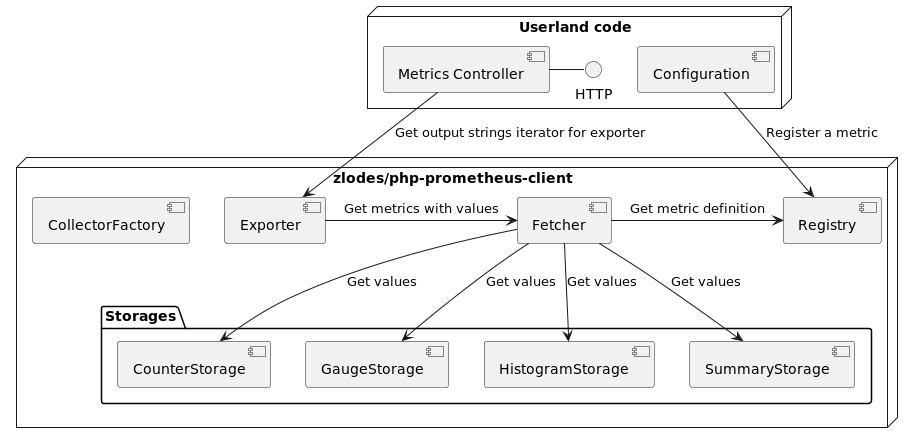

# PHP Prometheus Client

[](https://codecov.io/gh/zlodes/php-prometheus-client)

This package provides you an ability to collect and export [Prometheus](https://prometheus.io/) metrics from any modern PHP application.

## Why?

* Until now, there was no working Prometheus client for modern PHP
* Framework-agnostic
* Almost zero dependencies
* Won't break your business logic even if something is wrong with Metrics Storage
* Ready to use with static analysis tools (PHPStan, Psalm)

## Adapters
* For Laravel: [zlodes/prometheus-client-laravel](https://github.com/zlodes/php-prometheus-client-laravel)

## Installation

```shell
composer require zlodes/prometheus-client
```

## Flow

### Fetching metrics



Each class should be registered as a service. As a `singleton` in Laravel or `shared` service in Symfony.

## Simple example

```php
<?php

use Psr\Log\NullLogger;
use Zlodes\PrometheusClient\Collector\CollectorFactory;
use Zlodes\PrometheusClient\Exporter\FetcherExporter;
use Zlodes\PrometheusClient\Metric\Counter;
use Zlodes\PrometheusClient\Metric\Gauge;
use Zlodes\PrometheusClient\Metric\Histogram;
use Zlodes\PrometheusClient\Registry\ArrayRegistry;
use Zlodes\PrometheusClient\Storage\InMemoryStorage;

$registry = new ArrayRegistry();

$counterStorage = new InMemoryCounterStorage();
$gaugeStorage = new InMemoryGaugeStorage();
$histogramStorage = new InMemoryHistogramStorage();
$summaryStorage = new InMemorySummaryStorage();

// Register your metrics
$registry
    ->registerMetric(
        new Gauge('body_temperature', 'Body temperature in Celsius')
    )
    ->registerMetric(
        new Counter('steps', 'Steps count')
    )
    ->registerMetric(
        (new Histogram('http_request_duration_seconds', 'HTTP Request duration'))
            ->withBuckets([0.1, 0.5, 1]),
    )
    ->registerMetric(
        (new Summary('memory_used', 'Used memory in bytes'))
            ->withQuantiles([0.5, 0.9, 0.99])
    );

// Create a Collector factory

$collectorFactory = new CollectorFactory(
    $registry,
    $counterStorage,
    $gaugeStorage,
    $histogramStorage,
    $summaryStorage,
    new NullLogger(),
);

// Collect metrics
$bodyTemperatureGauge = $collectorFactory->gauge('body_temperature');

$bodyTemperatureGauge
    ->withLabels(['source' => 'armpit'])
    ->update(36.6);

$bodyTemperatureGauge
    ->withLabels(['source' => 'ass'])
    ->update(37.2);

$collectorFactory
    ->counter('steps')
    ->increment();

$requestTimer = $collectorFactory
    ->histogram('http_request_duration_seconds')
    ->startTimer();

usleep(50_000);

$requestTimer->stop();

$collectorFactory
    ->summary('memory_used')
    ->update(100);

$collectorFactory
    ->summary('memory_used')
    ->update(200);

// Export metrics
$fetcher = new StoredMetricsFetcher(
    $registry,
    $counterStorage,
    $gaugeStorage,
    $histogramStorage,
    $summaryStorage,
);

$exporter = new FetcherExporter($fetcher);

foreach ($exporter->export() as $metricOutput) {
    echo $metricOutput . "\n\n";
}
```

Output example:
```
# HELP steps Steps count
# TYPE steps counter
steps 1

# HELP body_temperature Body temperature in Celsius
# TYPE body_temperature gauge
body_temperature{source="armpit"} 36.6
body_temperature{source="ass"} 37.2

# HELP http_request_duration_seconds HTTP Request duration
# TYPE http_request_duration_seconds histogram
http_request_duration_seconds{le="0.1"} 1
http_request_duration_seconds{le="0.5"} 1
http_request_duration_seconds{le="1"} 1
http_request_duration_seconds{le="+Inf"} 1
http_request_duration_seconds 0.050070474
http_request_duration_seconds 1

# HELP memory_used Used memory in bytes
# TYPE memory_used summary
memory_used{quantile="0.5"} 150
memory_used{quantile="0.9"} 190
memory_used{quantile="0.99"} 199
memory_used 300
memory_used 2
```

## Testing

### Run tests

```shell
php ./vendor/bin/phpunit
```

### Creating your own Storage

#### Keys serialization

There is a [Serializer](PrometheusClient/KeySerialization/Serializer.php) interface (with JSON-based implementation) to simplify work with a key-value storage.

Example can be found in [InMemoryStorage](PrometheusClient/Storage/InMemoryStorage.php).

#### Storage Testing

There is a simple [trait](PrometheusClient/Storage/StorageTesting.php) to tests any storage you want. Here is an example:

```php
class InMemoryStorageTest extends TestCase
{
    use StorageTesting;

    private function createStorage(): Storage
    {
        return new InMemoryStorage();
    }
}
```
